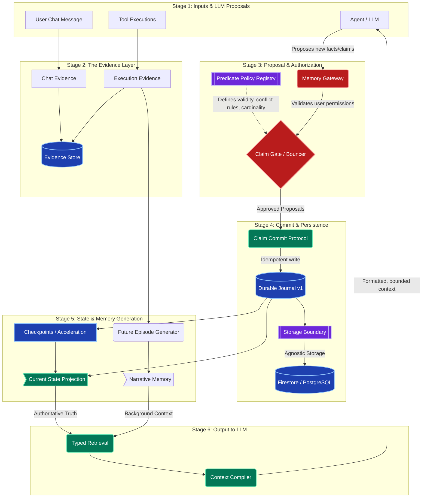

# OLBrain Target Memory Architecture

This document contains the detailed system architecture, including gates, control boundaries, and storage layers, ready to be used in diagramming tools like Eraser.io or Mermaid.

## Mermaid Architecture Diagram

You can copy and paste the code block below directly into any tool that supports Mermaid (like Notion, GitHub, or Mermaid Live Editor) to instantly generate the visual architecture graph for your CTO.

---

## Detailed Breakdown for the CTO (The "What Controls What" Guide)

If your CTO asks how data flows through this system and what prevents bad data from corrupting the agent, here is the exact breakdown of the boundaries and gates:

### 1. The Policy Boundary: **Predicate Policy Registry**
*   **What it is:** The hard-coded rulebook.
*   **What it controls:** It dictates exactly *what* can be remembered. It defines if a fact can only have one value (like "Date of Birth") or multiple values (like "Favorite Foods"), how conflicts are resolved, and if a fact is eligible for the Current State.
*   **Why it matters:** The LLM cannot invent arbitrary facts anymore. If a fact type isn't in the registry, it is rejected.

### 2. The Verification Boundary: **The Claim Gate**
*   **What it is:** The deterministic "Bouncer."
*   **What it controls:** It sits between the AI's "Proposals" and the actual database. It takes the AI's proposal, checks it against the Predicate Policy Registry, and decides if it should be `ACCEPTED`, `REJECTED`, or marked as a `CONFLICT`.
*   **Why it matters:** It strips the AI of the power to write directly to the database. The AI can only *ask* to write. Deterministic code makes the final decision.

### 3. The Truth Boundary: **The Durable Journal**
*   **What it is:** The sole authoritative commit ledger.
*   **What it controls:** It is the absolute source of truth. It records the approved claims securely. It never deletes data (unless a GDPR erasure is triggered). It simply adds new facts to the timeline.
*   **Why it matters:** If the system crashes, or if an acceleration cache breaks, the entire state of the agent can be perfectly rebuilt from the Durable Journal from scratch. 

### 4. The Data Portability Boundary: **The Storage Boundary**
*   **What it is:** The plug-in adapter between the architecture and the actual database software.
*   **What it controls:** It translates the Durable Journal's commands into database-specific code (Firestore or PostgreSQL). 
*   **Why it matters:** It completely decouples the memory architecture from the infrastructure. The memory logic (Gate, Journal, Compiler) does not know or care if it's running on Firestore or Postgres. 

### 5. The Output Boundary: **The Context Compiler**
*   **What it is:** The final formatting step before the AI sees its memory.
*   **What it controls:** It pulls the "Current State" (the hard facts) and the "Narrative Memory" (execution history/episodes) and explicitly separates them. 
*   **Why it matters:** It ensures that Narrative background context cannot secretly be interpreted by the AI as authoritative truth or instructions.
